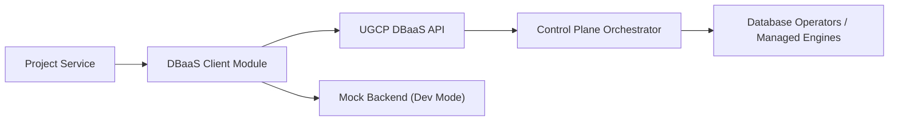

# DBaaS Client Architecture

## Purpose
This module standardizes how external projects consume UGCP DBaaS APIs with secure defaults and deterministic behavior.

## Scope Boundaries
- In scope: DBaaS control actions (create/list/delete instances, backups, restore, credential rotation).
- Out of scope: direct SQL driver connectivity, data-plane query execution, secret vault implementation.

## Architecture Diagram

## Key Design Choices
- Auth: bearer token from explicit token or token provider.
- Isolation: tenant/project headers required at call boundaries.
- Reliability: timeout + bounded retries + backoff.
- Safety: idempotency key support for mutating operations.
- Dev productivity: built-in mock mode with deterministic responses.

## Data Contracts
The module tracks typed entities:
- `DbaasInstance`
- `DbaasOperation`
- `DbaasBackup`

API contract reference: [../api/openapi.yaml](../api/openapi.yaml)
