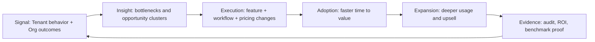

# eCommerce Category-King Operating Model

## Strategic Intent

ERP-eCommerce is positioned as a category-defining Product in the Sovereign ERP System. The operating model converts strategy into execution through measurable Tenant and Org outcomes, disciplined Service delivery, and Environment-grade governance.

## Category Definition

- **Primary category claim**: the fastest, most trustworthy operating plane for eCommerce workflows.
- **Buyer outcome**: 2x decision velocity with lower governance overhead.
- **Operator outcome**: auditable control, predictable performance, and resilient operations.
- **Economic outcome**: stronger gross retention, expansion revenue, and faster payback.

## Operating Model Pillars

| Pillar | Execution Mechanism | KPI Anchor |
|---|---|---|
| Workflow Superiority | opinionated workflow maps, guided automation, role-sensitive UX | cycle time reduction, task completion rate |
| Trust by Design | policy checks, audit evidence capture, role segregation | policy violation rate, audit pass rate |
| Economic Compounding | usage-to-value telemetry, expansion triggers, tiered packaging | NRR, expansion conversion, CAC payback |
| Delivery Velocity | quarterly value trains, release gates, runbook discipline | release frequency, change failure rate |
| Platform Leverage | shared API, identity, observability, and data contracts | integration lead time, incident MTTR |

## Category-King Flywheel

## 12-Month Execution Program

| Quarter | Product Track | GTM Track | Platform Track | Exit Criteria |
|---|---|---|---|---|
| Q1 | instrument top 3 workflows | sharpen ICP and value messaging | baseline SLO and telemetry coverage | benchmark baseline approved |
| Q2 | ship guided actions + policy UX | launch role-based onboarding plays | harden audit/event contracts | activation and trust KPIs improve |
| Q3 | launch expansion modules | land-and-expand motion by org maturity | optimize latency + reliability budgets | NRR trend > 115% |
| Q4 | automate decision loops | verticalized playbooks by segment | resilience drills and cost controls | board-ready efficiency metrics |

## Governance Cadence

- **Weekly Product-System review**: backlog priorities tied to KPI deltas.
- **Biweekly architecture and risk review**: security, reliability, and compliance drift checks.
- **Monthly operating review**: margin quality, retention trends, and roadmap confidence.
- **Quarterly strategy reset**: scenario planning, capital allocation, and target revisions.

## Board-Level Metric Stack

| Dimension | Metric | Target Band |
|---|---|---|
| Adoption | feature activation depth per Tenant | >70% on critical workflow set |
| Value | median time-to-value | <14 days enterprise onboarding |
| Trust | critical policy violations | 0 unresolved in prod |
| Reliability | p95 latency on critical path | <200ms |
| Economics | CAC payback | <12 months |
| Expansion | NRR | 115%-130% |

## Resource Allocation Rules

1. Fund work with explicit KPI traceability and measurable owner accountability.
2. Maintain non-negotiable trust gates: security, compliance, and reliability.
3. Prioritize workflows that compound retention and expansion, not vanity breadth.
4. Keep 10%-15% capacity for resilience, technical debt retirement, and runbook hardening.

## Operating Risks and Active Mitigations

| Risk | Early Signal | Mitigation |
|---|---|---|
| Feature sprawl without value density | flat activation, rising support tickets | stage-gated roadmap and value scoring |
| Governance drag | release slowdown from late control checks | policy-as-code and pre-merge control tests |
| Scale friction | rising p95 and queue lag | capacity triggers, query budgeting, caching strategy |
| GTM-Product disconnect | low adoption despite pipeline growth | closed-loop win/loss and usage telemetry |

## Linkage to Core Documentation

- [BRD](BRD.md)
- [PRD](PRD.md)
- [Enterprise Architecture Roadmap](EA-Roadmap.md)
- [Project Charter](Project-Charter.md)
- [Compliance Matrix](Compliance-Regulatory-Matrix.md)
