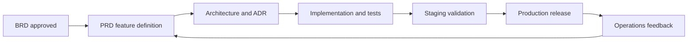

# Product Requirements Document (PRD)

## Product Overview

The Product provides multi-tenant workflow automation and operational intelligence through a web portal, Admin portal, and API. Tenants use the Product to manage Users, roles, events, billing, and integrations with full auditability.

## Product Personas

| Persona | Description | Primary Goals |
|---|---|---|
| Tenant Admin | Owns Tenant setup, roles, billing, and policy | Control access, monitor usage, manage compliance |
| Org Admin | Manages Org-level User operations | Assign roles, monitor activity, resolve issues |
| End User | Uses business workflows in web portal | Complete tasks quickly with clear feedback |
| Security Analyst | Reviews audit events and access posture | Detect anomalies and validate controls |
| Finance Manager | Tracks subscription and invoices | Ensure accurate billing and spend transparency |
| Integration Engineer | Connects Product to external Services | Reliable APIs, webhooks, and event contracts |

## User Journeys

### Journey 1: Tenant Onboarding

1. Tenant Admin signs in and creates Tenant profile.
2. System provisions default Org and baseline RBAC policy.
3. Tenant Admin invites Users and assigns roles.
4. Tenant Admin configures billing and notifications.
5. System confirms readiness with onboarding checklist.

### Journey 2: Secure Role Assignment

1. Org Admin opens User directory.
2. Org Admin selects User and role template.
3. System validates constraints and segregation rules.
4. System writes audit event and sends notification.

### Journey 3: Billing Visibility

1. Finance Manager opens billing dashboard.
2. System displays subscription, usage, and invoices.
3. Finance Manager exports month-end report.

## Feature Set

### MVP

- Tenant and Org management
- User management and RBAC
- Audit log explorer
- Billing summary and invoice list
- Notification center
- API keys and integration webhooks

### Post-MVP

- Advanced policy simulation for RBAC
- Multi-currency billing and tax localization
- Incident assistant and proactive anomaly recommendations

## Functional Requirements

1. The API must enforce Tenant and Org context on all data-access endpoints.
2. Admins must manage Users, roles, and API keys through portal UI.
3. Audit events must capture actor, target, action, and Environment metadata.
4. Billing Service must support subscription upgrades/downgrades and usage metering.
5. Notification Service must route by channel preferences and criticality.
6. Integration Service must sign outgoing webhook payloads.

## Non-Functional Requirements

- Availability: 99.9% monthly per production Environment.
- Performance: p95 API latency below 200 ms for common reads.
- Security: encrypted in transit and at rest for sensitive data.
- Scalability: support 10,000 concurrent Users and burst events.
- Observability: traceable request path across all core Services.
- Recoverability: RPO <= 15 minutes, RTO <= 60 minutes.

## Acceptance Criteria (Selected)

| Feature | Acceptance Criteria |
|---|---|
| Tenant creation | Admin can create Tenant, default Org is provisioned, audit event exists |
| Role assignment | Only Admin roles can assign roles, conflict checks run, notification sent |
| Billing charge | Charge event appears in billing ledger and invoice line item |
| Audit log | Filter by Tenant, Org, actor, action, and date range |
| Notifications | Failed deliveries are retried and visible in Admin diagnostics |

## Use Cases

- **UC-01**: Create Tenant and invite first Org Admin.
- **UC-02**: Assign RBAC role to User with dual approval policy.
- **UC-03**: Generate monthly invoice and export finance report.
- **UC-04**: Query audit trail for privileged actions.
- **UC-05**: Register webhook integration and validate callback signatures.

## Workflow Overview

## Dependencies

- Identity provider with OAuth2/OIDC and JWT.
- Payment processor API.
- Email provider and webhook infrastructure.
- Centralized observability stack.

## Release Strategy

- Sprint-based delivery with feature flags.
- Dev -> Staging -> Prod promotion through Fleet GitOps policy.
- Canary rollout for critical API changes.

