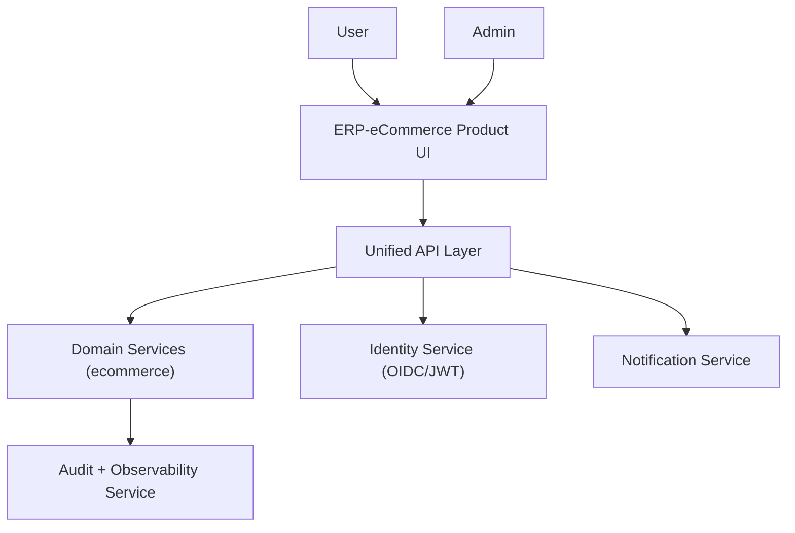
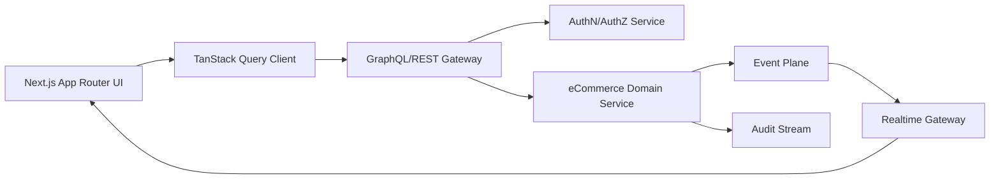
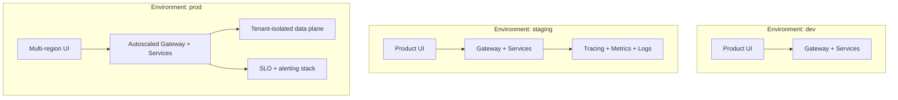
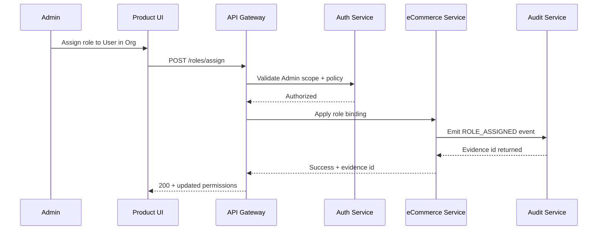

# eCommerce Category-King Architecture Addendum

## Mission

This addendum extends the core Software Architecture for ERP-eCommerce with category-king criteria: high-throughput UX, strict Tenant and Org isolation, resilient Service behavior, and operator-grade observability in every Environment.

## Context Diagram

## Container and Interaction View

## Deployment Topology

## Architecture Control Points

| Control Point | Standard | Verification |
|---|---|---|
| Tenant isolation | tenant_id on all records + scoped query predicates | contract tests + query lint rules |
| Access control | policy-first checks before mutation | auth regression suite + audit sampling |
| Auditability | immutable event envelope for critical actions | event schema validation + replay tests |
| Performance | latency budgets per top workflow | SLO dashboards + load test gates |
| Release safety | progressive deployment + rollback trigger | canary policy + automated rollback drills |

## Critical Sequence: Role Assignment with Audit Evidence

## Performance and Reliability Budgets

| Path | Budget | SLO |
|---|---|---|
| interactive read workflows | p95 < 200ms | 99.9% availability |
| mutation workflows | p95 < 300ms | <0.5% failed mutations |
| realtime invalidation | propagation < 2s | 99.5% under target |
| audit write | durable write < 500ms | zero lost critical events |

## Architecture Decision Triggers

- If p95 exceeds threshold for 3 consecutive releases, enforce performance hardening sprint.
- If policy violation anomalies rise above baseline, block feature releases pending control fix.
- If incident MTTR worsens quarter-over-quarter, require runbook redesign and ownership update.

## Linkage to Core Architecture Set

- [SAD](SAD.md)
- [HLD](HLD.md)
- [LLD](LLD.md)
- [Security Architecture](Security-Architecture.md)
- [Data Architecture](Data-Architecture.md)
- [Technical Specifications](Technical-Specifications.md)
