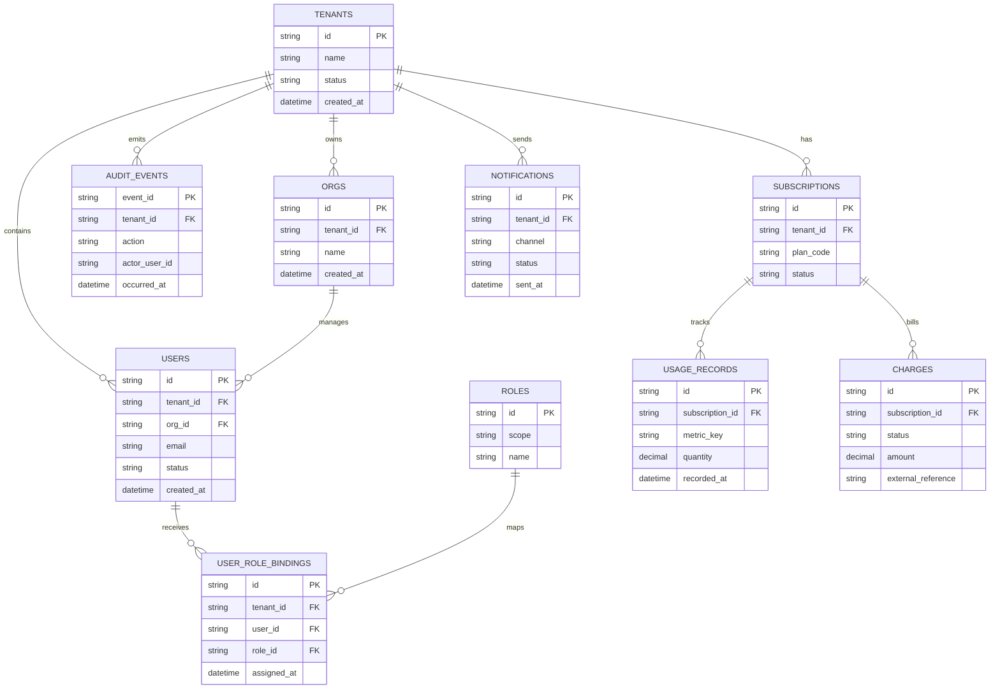

# Data Architecture

## Multi-Tenant Data Strategy

- Every business table includes `tenant_id` and optional `org_id`.
- Tenant-scoped indexes support high-cardinality query performance.
- Access policies require tenant context from validated token claims.

## ERD

## Data Dictionary

| Entity | Field | Type | Description | PII Class |
|---|---|---|---|---|
| users | email | string | User login and contact | PII-High |
| users | status | string | active/suspended/invited | PII-Low |
| audit_events | actor_user_id | string | User performing action | PII-Moderate |
| charges | amount | decimal | billed amount | Financial-Sensitive |
| notifications | channel | string | email/webhook/in_app | Operational |

## Retention Policies

| Data Set | Retention | Rationale |
|---|---|---|
| Audit events | 7 years | Compliance and investigations |
| Billing charges | 10 years | Finance and tax obligations |
| Notifications logs | 18 months | Operational troubleshooting |
| Access logs | 13 months | Security and incident response |
| Usage metrics | 24 months | Capacity and billing analytics |

## PII Classification

- **PII-High**: email, name, payment metadata references.
- **PII-Moderate**: User IDs linked to actions.
- **PII-Low**: status and role metadata without direct identity.

## Data Quality Rules

- Unique constraints on Tenant + email for Users.
- Non-null tenant_id for all tenant-scoped entities.
- Clock synchronization for all event timestamps.

## Backup and Restore Notes

- Point-in-time recovery snapshots every 15 minutes.
- Daily full backup with encryption and region replication.
- Quarterly restore drill by Environment.

