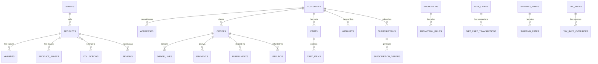

# Data Architecture
## ERP-eCommerce — B2C/D2C eCommerce Platform
### Version 2.0 | March 2026

---

## 1. Multi-Tenant Data Strategy

- Every business table includes `tenant_id TEXT NOT NULL` (representing the merchant/store) as the first column in composite keys and all indexes
- Row-level security (RLS) policies enforce merchant isolation at the PostgreSQL level
- All queries include tenant_id predicate; application middleware injects tenant from JWT or API key
- Customer data is tenant-scoped: a consumer shopping at Store A and Store B has separate customer records
- Cross-tenant analytics available only to platform administrators for aggregate reporting

---

## 2. Core Entity Relationship Model



---

## 3. Table Definitions

### 3.1 Store Configuration

```sql
CREATE TABLE stores (
    tenant_id       TEXT NOT NULL,
    id              UUID PRIMARY KEY DEFAULT gen_random_uuid(),
    name            TEXT NOT NULL,
    domain          TEXT,                    -- custom domain (e.g., shop.mybrand.com)
    subdomain       TEXT NOT NULL,           -- platform subdomain (e.g., mybrand.sovereign.shop)
    currency        TEXT NOT NULL DEFAULT 'USD',
    timezone        TEXT NOT NULL DEFAULT 'America/New_York',
    locale          TEXT NOT NULL DEFAULT 'en-US',
    logo_url        TEXT,
    favicon_url     TEXT,
    theme_config    JSONB NOT NULL DEFAULT '{}',  -- colors, fonts, layout preferences
    checkout_config JSONB NOT NULL DEFAULT '{}',  -- guest checkout, express pay, custom fields
    seo_config      JSONB NOT NULL DEFAULT '{}',  -- default meta, robots.txt, sitemap settings
    analytics_config JSONB DEFAULT '{}',     -- GA4 ID, Meta Pixel ID, etc.
    is_active       BOOLEAN NOT NULL DEFAULT true,
    launched_at     TIMESTAMPTZ,
    created_at      TIMESTAMPTZ NOT NULL DEFAULT now(),
    updated_at      TIMESTAMPTZ NOT NULL DEFAULT now(),
    UNIQUE(subdomain)
);
```

### 3.2 Product Catalog

```sql
CREATE TABLE products (
    tenant_id       TEXT NOT NULL,
    id              UUID PRIMARY KEY DEFAULT gen_random_uuid(),
    title           TEXT NOT NULL,
    slug            TEXT NOT NULL,
    description     TEXT,                    -- rich text (HTML)
    product_type    TEXT,                    -- physical, digital, service, gift_card, bundle
    vendor          TEXT,
    tags            TEXT[] DEFAULT '{}',
    status          TEXT NOT NULL DEFAULT 'draft',  -- draft, active, archived
    template_suffix TEXT,                    -- custom Liquid/template variant
    seo_title       TEXT,
    seo_description TEXT,
    published_at    TIMESTAMPTZ,
    created_at      TIMESTAMPTZ NOT NULL DEFAULT now(),
    updated_at      TIMESTAMPTZ NOT NULL DEFAULT now(),
    UNIQUE(tenant_id, slug)
);

CREATE TABLE variants (
    tenant_id       TEXT NOT NULL,
    id              UUID PRIMARY KEY DEFAULT gen_random_uuid(),
    product_id      UUID NOT NULL REFERENCES products(id) ON DELETE CASCADE,
    title           TEXT NOT NULL,           -- e.g., "Small / Red"
    sku             TEXT,
    barcode         TEXT,
    price           NUMERIC(12,2) NOT NULL,
    compare_at_price NUMERIC(12,2),         -- original/strikethrough price
    cost_per_item   NUMERIC(12,2),
    option1         TEXT,                    -- e.g., "Small"
    option2         TEXT,                    -- e.g., "Red"
    option3         TEXT,                    -- e.g., "Cotton"
    weight_grams    INTEGER,
    requires_shipping BOOLEAN NOT NULL DEFAULT true,
    taxable         BOOLEAN NOT NULL DEFAULT true,
    tax_code        TEXT,
    inventory_quantity INTEGER NOT NULL DEFAULT 0,
    inventory_policy TEXT NOT NULL DEFAULT 'deny',  -- deny (no oversell) or continue
    position        INTEGER NOT NULL DEFAULT 0,
    image_id        UUID,
    created_at      TIMESTAMPTZ NOT NULL DEFAULT now(),
    updated_at      TIMESTAMPTZ NOT NULL DEFAULT now()
);

CREATE TABLE product_images (
    tenant_id       TEXT NOT NULL,
    id              UUID PRIMARY KEY DEFAULT gen_random_uuid(),
    product_id      UUID NOT NULL REFERENCES products(id) ON DELETE CASCADE,
    src             TEXT NOT NULL,           -- original image URL
    alt             TEXT,
    width           INTEGER,
    height          INTEGER,
    position        INTEGER NOT NULL DEFAULT 0,
    variant_ids     UUID[] DEFAULT '{}',    -- associated variant IDs
    created_at      TIMESTAMPTZ NOT NULL DEFAULT now()
);

CREATE TABLE collections (
    tenant_id       TEXT NOT NULL,
    id              UUID PRIMARY KEY DEFAULT gen_random_uuid(),
    title           TEXT NOT NULL,
    slug            TEXT NOT NULL,
    description     TEXT,
    image_url       TEXT,
    collection_type TEXT NOT NULL DEFAULT 'manual',  -- manual or smart
    rules           JSONB,                  -- smart collection rules: [{"field": "tag", "condition": "equals", "value": "sale"}]
    sort_order      TEXT NOT NULL DEFAULT 'best-selling',  -- best-selling, alpha-asc, alpha-desc, price-asc, price-desc, created-desc, manual
    seo_title       TEXT,
    seo_description TEXT,
    published_at    TIMESTAMPTZ,
    created_at      TIMESTAMPTZ NOT NULL DEFAULT now(),
    updated_at      TIMESTAMPTZ NOT NULL DEFAULT now(),
    UNIQUE(tenant_id, slug)
);

CREATE TABLE collection_products (
    tenant_id       TEXT NOT NULL,
    collection_id   UUID NOT NULL REFERENCES collections(id) ON DELETE CASCADE,
    product_id      UUID NOT NULL REFERENCES products(id) ON DELETE CASCADE,
    position        INTEGER NOT NULL DEFAULT 0,
    PRIMARY KEY (collection_id, product_id)
);
```

### 3.3 Customers

```sql
CREATE TABLE customers (
    tenant_id       TEXT NOT NULL,
    id              UUID PRIMARY KEY DEFAULT gen_random_uuid(),
    email           TEXT NOT NULL,
    phone           TEXT,
    first_name      TEXT,
    last_name       TEXT,
    password_hash   TEXT,                    -- Argon2id hash; null for guest accounts
    accepts_marketing BOOLEAN NOT NULL DEFAULT false,
    marketing_consent_at TIMESTAMPTZ,
    tags            TEXT[] DEFAULT '{}',
    note            TEXT,                    -- merchant internal note
    total_orders    INTEGER NOT NULL DEFAULT 0,
    total_spent     NUMERIC(14,2) NOT NULL DEFAULT 0,
    last_order_at   TIMESTAMPTZ,
    locale          TEXT DEFAULT 'en',
    state           TEXT NOT NULL DEFAULT 'enabled',  -- enabled, disabled, invited
    verified_email  BOOLEAN NOT NULL DEFAULT false,
    created_at      TIMESTAMPTZ NOT NULL DEFAULT now(),
    updated_at      TIMESTAMPTZ NOT NULL DEFAULT now(),
    UNIQUE(tenant_id, email)
);

CREATE TABLE addresses (
    tenant_id       TEXT NOT NULL,
    id              UUID PRIMARY KEY DEFAULT gen_random_uuid(),
    customer_id     UUID NOT NULL REFERENCES customers(id) ON DELETE CASCADE,
    first_name      TEXT,
    last_name       TEXT,
    company         TEXT,
    address1        TEXT NOT NULL,
    address2        TEXT,
    city            TEXT NOT NULL,
    province        TEXT,
    province_code   TEXT,
    country         TEXT NOT NULL,
    country_code    TEXT NOT NULL,
    zip             TEXT NOT NULL,
    phone           TEXT,
    is_default      BOOLEAN NOT NULL DEFAULT false,
    created_at      TIMESTAMPTZ NOT NULL DEFAULT now(),
    updated_at      TIMESTAMPTZ NOT NULL DEFAULT now()
);
```

### 3.4 Shopping Carts

```sql
CREATE TABLE carts (
    tenant_id       TEXT NOT NULL,
    id              UUID PRIMARY KEY DEFAULT gen_random_uuid(),
    customer_id     UUID REFERENCES customers(id),  -- null for anonymous carts
    token           TEXT NOT NULL UNIQUE,    -- cart token stored in cookie
    email           TEXT,                    -- captured at checkout start
    currency        TEXT NOT NULL DEFAULT 'USD',
    subtotal        NUMERIC(14,2) NOT NULL DEFAULT 0,
    discount_total  NUMERIC(14,2) NOT NULL DEFAULT 0,
    tax_total       NUMERIC(14,2) NOT NULL DEFAULT 0,
    shipping_total  NUMERIC(14,2) NOT NULL DEFAULT 0,
    total           NUMERIC(14,2) NOT NULL DEFAULT 0,
    discount_codes  TEXT[] DEFAULT '{}',
    note            TEXT,
    shipping_address_id UUID,
    shipping_method JSONB,                  -- selected carrier and rate
    abandoned_checkout_url TEXT,             -- URL to resume checkout
    recovered       BOOLEAN NOT NULL DEFAULT false,
    expires_at      TIMESTAMPTZ,
    created_at      TIMESTAMPTZ NOT NULL DEFAULT now(),
    updated_at      TIMESTAMPTZ NOT NULL DEFAULT now()
);

CREATE TABLE cart_items (
    tenant_id       TEXT NOT NULL,
    id              UUID PRIMARY KEY DEFAULT gen_random_uuid(),
    cart_id         UUID NOT NULL REFERENCES carts(id) ON DELETE CASCADE,
    variant_id      UUID NOT NULL REFERENCES variants(id),
    quantity        INTEGER NOT NULL DEFAULT 1,
    properties      JSONB DEFAULT '{}',     -- custom properties (e.g., engraving text)
    created_at      TIMESTAMPTZ NOT NULL DEFAULT now(),
    updated_at      TIMESTAMPTZ NOT NULL DEFAULT now()
);
```

### 3.5 Orders

```sql
CREATE TABLE orders (
    tenant_id       TEXT NOT NULL,
    id              UUID PRIMARY KEY DEFAULT gen_random_uuid(),
    order_number    BIGINT NOT NULL,        -- sequential per tenant (e.g., #1001, #1002)
    customer_id     UUID REFERENCES customers(id),
    email           TEXT NOT NULL,
    phone           TEXT,
    currency        TEXT NOT NULL DEFAULT 'USD',
    subtotal        NUMERIC(14,2) NOT NULL,
    discount_total  NUMERIC(14,2) NOT NULL DEFAULT 0,
    shipping_total  NUMERIC(14,2) NOT NULL DEFAULT 0,
    tax_total       NUMERIC(14,2) NOT NULL DEFAULT 0,
    total           NUMERIC(14,2) NOT NULL,
    financial_status TEXT NOT NULL DEFAULT 'pending',  -- pending, authorized, paid, partially_refunded, refunded, voided
    fulfillment_status TEXT,                -- null (unfulfilled), partial, fulfilled
    cancel_reason   TEXT,
    cancelled_at    TIMESTAMPTZ,
    source_name     TEXT DEFAULT 'web',     -- web, mobile, api, pos, social
    tags            TEXT[] DEFAULT '{}',
    note            TEXT,                   -- customer note
    staff_note      TEXT,                   -- merchant internal note
    discount_codes  JSONB DEFAULT '[]',     -- applied discount details
    shipping_address JSONB NOT NULL,        -- snapshot at time of order
    billing_address JSONB NOT NULL,
    shipping_lines  JSONB DEFAULT '[]',     -- shipping method and cost details
    tax_lines       JSONB DEFAULT '[]',     -- tax breakdown
    browser_ip      INET,
    user_agent      TEXT,
    landing_site    TEXT,
    referring_site  TEXT,
    processed_at    TIMESTAMPTZ,
    closed_at       TIMESTAMPTZ,
    created_at      TIMESTAMPTZ NOT NULL DEFAULT now(),
    updated_at      TIMESTAMPTZ NOT NULL DEFAULT now(),
    UNIQUE(tenant_id, order_number)
);

CREATE TABLE order_lines (
    tenant_id       TEXT NOT NULL,
    id              UUID PRIMARY KEY DEFAULT gen_random_uuid(),
    order_id        UUID NOT NULL REFERENCES orders(id) ON DELETE CASCADE,
    variant_id      UUID NOT NULL,
    product_id      UUID NOT NULL,
    title           TEXT NOT NULL,           -- product title snapshot
    variant_title   TEXT,                    -- variant title snapshot
    sku             TEXT,
    quantity        INTEGER NOT NULL,
    price           NUMERIC(12,2) NOT NULL,  -- per-unit price
    total_discount  NUMERIC(12,2) NOT NULL DEFAULT 0,
    tax_lines       JSONB DEFAULT '[]',
    fulfillable_quantity INTEGER NOT NULL,
    fulfillment_status TEXT,                -- null, partial, fulfilled
    requires_shipping BOOLEAN NOT NULL DEFAULT true,
    properties      JSONB DEFAULT '{}',
    created_at      TIMESTAMPTZ NOT NULL DEFAULT now()
);
```

### 3.6 Payments and Refunds

```sql
CREATE TABLE payments (
    tenant_id       TEXT NOT NULL,
    id              UUID PRIMARY KEY DEFAULT gen_random_uuid(),
    order_id        UUID NOT NULL REFERENCES orders(id),
    gateway         TEXT NOT NULL,           -- stripe, paypal, adyen
    gateway_transaction_id TEXT,
    amount          NUMERIC(14,2) NOT NULL,
    currency        TEXT NOT NULL,
    status          TEXT NOT NULL,           -- pending, authorized, captured, failed, voided
    payment_method  TEXT,                    -- credit_card, paypal, apple_pay, google_pay, bnpl
    card_brand      TEXT,                    -- visa, mastercard, amex (if card)
    card_last4      TEXT,                    -- last 4 digits (if card)
    error_code      TEXT,
    error_message   TEXT,
    authorized_at   TIMESTAMPTZ,
    captured_at     TIMESTAMPTZ,
    created_at      TIMESTAMPTZ NOT NULL DEFAULT now()
);

CREATE TABLE refunds (
    tenant_id       TEXT NOT NULL,
    id              UUID PRIMARY KEY DEFAULT gen_random_uuid(),
    order_id        UUID NOT NULL REFERENCES orders(id),
    payment_id      UUID REFERENCES payments(id),
    amount          NUMERIC(14,2) NOT NULL,
    currency        TEXT NOT NULL,
    reason          TEXT,                    -- customer_request, damaged, wrong_item, other
    note            TEXT,
    gateway_refund_id TEXT,
    status          TEXT NOT NULL DEFAULT 'pending',  -- pending, processed, failed
    created_at      TIMESTAMPTZ NOT NULL DEFAULT now()
);
```

### 3.7 Subscriptions

```sql
CREATE TABLE subscriptions (
    tenant_id       TEXT NOT NULL,
    id              UUID PRIMARY KEY DEFAULT gen_random_uuid(),
    customer_id     UUID NOT NULL REFERENCES customers(id),
    status          TEXT NOT NULL DEFAULT 'active',  -- active, paused, past_due, cancelled, expired
    plan_name       TEXT NOT NULL,
    billing_policy  TEXT NOT NULL DEFAULT 'pay_per_delivery',  -- pay_per_delivery, prepaid
    frequency_value INTEGER NOT NULL,       -- e.g., 1
    frequency_unit  TEXT NOT NULL,          -- day, week, month, year
    currency        TEXT NOT NULL DEFAULT 'USD',
    price           NUMERIC(12,2) NOT NULL,
    discount_pct    NUMERIC(5,2) DEFAULT 0, -- subscribe-and-save discount
    next_billing_at TIMESTAMPTZ NOT NULL,
    trial_ends_at   TIMESTAMPTZ,
    paused_at       TIMESTAMPTZ,
    cancelled_at    TIMESTAMPTZ,
    cancellation_reason TEXT,
    payment_method_token TEXT,              -- stored payment token for recurring billing
    shipping_address_id UUID,
    dunning_attempts INTEGER NOT NULL DEFAULT 0,
    max_dunning_attempts INTEGER NOT NULL DEFAULT 4,
    created_at      TIMESTAMPTZ NOT NULL DEFAULT now(),
    updated_at      TIMESTAMPTZ NOT NULL DEFAULT now()
);

CREATE TABLE subscription_items (
    tenant_id       TEXT NOT NULL,
    id              UUID PRIMARY KEY DEFAULT gen_random_uuid(),
    subscription_id UUID NOT NULL REFERENCES subscriptions(id) ON DELETE CASCADE,
    variant_id      UUID NOT NULL REFERENCES variants(id),
    quantity        INTEGER NOT NULL DEFAULT 1,
    price           NUMERIC(12,2) NOT NULL,
    created_at      TIMESTAMPTZ NOT NULL DEFAULT now()
);

CREATE TABLE subscription_orders (
    tenant_id       TEXT NOT NULL,
    id              UUID PRIMARY KEY DEFAULT gen_random_uuid(),
    subscription_id UUID NOT NULL REFERENCES subscriptions(id),
    order_id        UUID REFERENCES orders(id),
    billing_date    DATE NOT NULL,
    status          TEXT NOT NULL DEFAULT 'scheduled',  -- scheduled, processing, completed, failed, skipped
    created_at      TIMESTAMPTZ NOT NULL DEFAULT now()
);
```

### 3.8 Reviews and Wishlists

```sql
CREATE TABLE reviews (
    tenant_id       TEXT NOT NULL,
    id              UUID PRIMARY KEY DEFAULT gen_random_uuid(),
    product_id      UUID NOT NULL REFERENCES products(id),
    customer_id     UUID REFERENCES customers(id),
    order_id        UUID REFERENCES orders(id),
    rating          SMALLINT NOT NULL CHECK (rating BETWEEN 1 AND 5),
    title           TEXT,
    body            TEXT,
    author_name     TEXT NOT NULL,
    status          TEXT NOT NULL DEFAULT 'pending',  -- pending, approved, rejected, spam
    photos          TEXT[] DEFAULT '{}',     -- review photo URLs
    helpful_count   INTEGER NOT NULL DEFAULT 0,
    verified_purchase BOOLEAN NOT NULL DEFAULT false,
    published_at    TIMESTAMPTZ,
    created_at      TIMESTAMPTZ NOT NULL DEFAULT now()
);

CREATE TABLE wishlists (
    tenant_id       TEXT NOT NULL,
    id              UUID PRIMARY KEY DEFAULT gen_random_uuid(),
    customer_id     UUID NOT NULL REFERENCES customers(id),
    name            TEXT NOT NULL DEFAULT 'My Wishlist',
    is_public       BOOLEAN NOT NULL DEFAULT false,
    created_at      TIMESTAMPTZ NOT NULL DEFAULT now()
);

CREATE TABLE wishlist_items (
    tenant_id       TEXT NOT NULL,
    id              UUID PRIMARY KEY DEFAULT gen_random_uuid(),
    wishlist_id     UUID NOT NULL REFERENCES wishlists(id) ON DELETE CASCADE,
    product_id      UUID NOT NULL REFERENCES products(id),
    variant_id      UUID REFERENCES variants(id),
    added_at        TIMESTAMPTZ NOT NULL DEFAULT now()
);
```

### 3.9 Promotions and Gift Cards

```sql
CREATE TABLE promotions (
    tenant_id       TEXT NOT NULL,
    id              UUID PRIMARY KEY DEFAULT gen_random_uuid(),
    code            TEXT,                    -- null for automatic discounts
    title           TEXT NOT NULL,
    discount_type   TEXT NOT NULL,           -- percentage, fixed_amount, free_shipping, bogo
    discount_value  NUMERIC(12,2) NOT NULL,
    applies_to      TEXT NOT NULL DEFAULT 'all',  -- all, specific_products, specific_collections
    target_ids      UUID[] DEFAULT '{}',    -- product or collection IDs if specific
    min_purchase_amount NUMERIC(12,2),
    min_quantity    INTEGER,
    max_uses        INTEGER,                -- null for unlimited
    max_uses_per_customer INTEGER DEFAULT 1,
    times_used      INTEGER NOT NULL DEFAULT 0,
    starts_at       TIMESTAMPTZ NOT NULL,
    ends_at         TIMESTAMPTZ,
    is_active       BOOLEAN NOT NULL DEFAULT true,
    stackable       BOOLEAN NOT NULL DEFAULT false,
    created_at      TIMESTAMPTZ NOT NULL DEFAULT now(),
    updated_at      TIMESTAMPTZ NOT NULL DEFAULT now()
);

CREATE TABLE gift_cards (
    tenant_id       TEXT NOT NULL,
    id              UUID PRIMARY KEY DEFAULT gen_random_uuid(),
    code            TEXT NOT NULL,
    initial_value   NUMERIC(12,2) NOT NULL,
    balance         NUMERIC(12,2) NOT NULL,
    currency        TEXT NOT NULL DEFAULT 'USD',
    customer_id     UUID REFERENCES customers(id),  -- purchaser
    recipient_email TEXT,
    recipient_name  TEXT,
    message         TEXT,
    expires_at      TIMESTAMPTZ,
    disabled_at     TIMESTAMPTZ,
    created_at      TIMESTAMPTZ NOT NULL DEFAULT now(),
    UNIQUE(tenant_id, code)
);

CREATE TABLE gift_card_transactions (
    tenant_id       TEXT NOT NULL,
    id              UUID PRIMARY KEY DEFAULT gen_random_uuid(),
    gift_card_id    UUID NOT NULL REFERENCES gift_cards(id),
    order_id        UUID REFERENCES orders(id),
    amount          NUMERIC(12,2) NOT NULL,  -- negative for redemption, positive for load
    note            TEXT,
    created_at      TIMESTAMPTZ NOT NULL DEFAULT now()
);
```

### 3.10 Shipping and Tax

```sql
CREATE TABLE shipping_zones (
    tenant_id       TEXT NOT NULL,
    id              UUID PRIMARY KEY DEFAULT gen_random_uuid(),
    name            TEXT NOT NULL,
    countries       TEXT[] NOT NULL,         -- country codes
    provinces       TEXT[] DEFAULT '{}',     -- province/state codes (if zone is sub-country)
    created_at      TIMESTAMPTZ NOT NULL DEFAULT now()
);

CREATE TABLE shipping_rates (
    tenant_id       TEXT NOT NULL,
    id              UUID PRIMARY KEY DEFAULT gen_random_uuid(),
    zone_id         UUID NOT NULL REFERENCES shipping_zones(id) ON DELETE CASCADE,
    name            TEXT NOT NULL,           -- e.g., "Standard Shipping", "Express"
    rate_type       TEXT NOT NULL,           -- flat, weight_based, price_based, carrier_calculated
    price           NUMERIC(10,2),          -- for flat rate
    min_weight_grams INTEGER,
    max_weight_grams INTEGER,
    min_order_total NUMERIC(10,2),
    max_order_total NUMERIC(10,2),
    carrier         TEXT,                   -- for carrier-calculated rates
    service_code    TEXT,
    estimated_days_min INTEGER,
    estimated_days_max INTEGER,
    created_at      TIMESTAMPTZ NOT NULL DEFAULT now()
);

CREATE TABLE tax_rules (
    tenant_id       TEXT NOT NULL,
    id              UUID PRIMARY KEY DEFAULT gen_random_uuid(),
    name            TEXT NOT NULL,
    country_code    TEXT NOT NULL,
    province_code   TEXT,
    tax_rate        NUMERIC(6,4) NOT NULL,  -- e.g., 0.0825 for 8.25%
    tax_type        TEXT NOT NULL DEFAULT 'normal',  -- normal, reduced, zero, exempt
    applies_to_shipping BOOLEAN NOT NULL DEFAULT false,
    provider        TEXT DEFAULT 'manual',   -- manual, avalara, taxjar
    created_at      TIMESTAMPTZ NOT NULL DEFAULT now()
);
```

---

## 4. Indexing Strategy

```sql
-- Product search and browsing
CREATE INDEX idx_products_tenant_status ON products(tenant_id, status) WHERE status = 'active';
CREATE INDEX idx_products_slug ON products(tenant_id, slug);
CREATE INDEX idx_products_tags ON products USING gin(tags);
CREATE INDEX idx_products_search ON products USING gin(to_tsvector('english', title || ' ' || coalesce(description, '')));
CREATE INDEX idx_variants_product ON variants(tenant_id, product_id);
CREATE INDEX idx_variants_sku ON variants(tenant_id, sku) WHERE sku IS NOT NULL;

-- Collection browsing
CREATE INDEX idx_collection_products_coll ON collection_products(collection_id, position);
CREATE INDEX idx_collection_products_prod ON collection_products(product_id);

-- Customer lookup
CREATE INDEX idx_customers_email ON customers(tenant_id, email);
CREATE INDEX idx_customers_tags ON customers USING gin(tags);

-- Cart operations
CREATE INDEX idx_carts_token ON carts(token);
CREATE INDEX idx_carts_customer ON carts(tenant_id, customer_id) WHERE customer_id IS NOT NULL;
CREATE INDEX idx_carts_abandoned ON carts(tenant_id, updated_at) WHERE customer_id IS NOT NULL AND recovered = false;

-- Order processing
CREATE INDEX idx_orders_customer ON orders(tenant_id, customer_id, created_at DESC);
CREATE INDEX idx_orders_number ON orders(tenant_id, order_number);
CREATE INDEX idx_orders_status ON orders(tenant_id, financial_status, fulfillment_status);
CREATE INDEX idx_order_lines_order ON order_lines(order_id);

-- Subscription billing
CREATE INDEX idx_subscriptions_billing ON subscriptions(tenant_id, next_billing_at) WHERE status = 'active';
CREATE INDEX idx_subscriptions_customer ON subscriptions(tenant_id, customer_id);

-- Review display
CREATE INDEX idx_reviews_product ON reviews(tenant_id, product_id, status) WHERE status = 'approved';
CREATE INDEX idx_reviews_rating ON reviews(tenant_id, product_id, rating);
```

---

## 5. Data Volumes and Retention

| Entity | Expected Volume (Year 1) | Growth Rate | Retention |
|--------|--------------------------|-------------|-----------|
| Stores (merchants) | 5,000 | 100% annually | Indefinite |
| Products | 5,000,000 (across all merchants) | 80% annually | Indefinite |
| Variants | 15,000,000 | 80% annually | Indefinite |
| Customers | 10,000,000 | 150% annually | Per merchant policy (min 3 years) |
| Carts | 50,000,000 | 200% annually | 90 days (then purge) |
| Orders | 20,000,000 | 120% annually | 7 years (regulatory) |
| Reviews | 5,000,000 | 100% annually | Indefinite |
| Subscriptions | 500,000 | 200% annually | Indefinite (plus 2 years post-cancel) |
| Behavioral Events | 500,000,000 | 200% annually | 12 months (then aggregate) |

---

## 6. Behavioral Event Schema

```sql
CREATE TABLE customer_events (
    tenant_id       TEXT NOT NULL,
    id              UUID PRIMARY KEY DEFAULT gen_random_uuid(),
    customer_id     UUID,                   -- null for anonymous
    session_id      TEXT NOT NULL,
    event_type      TEXT NOT NULL,           -- page_view, product_view, search, add_to_cart, remove_from_cart, begin_checkout, purchase, review, wishlist_add
    event_data      JSONB NOT NULL,          -- event-specific payload
    page_url        TEXT,
    referrer        TEXT,
    device_type     TEXT,                    -- desktop, mobile, tablet
    browser         TEXT,
    country_code    TEXT,
    created_at      TIMESTAMPTZ NOT NULL DEFAULT now()
);

-- Partitioned by month for efficient retention management
CREATE INDEX idx_events_customer ON customer_events(tenant_id, customer_id, created_at DESC);
CREATE INDEX idx_events_session ON customer_events(session_id, created_at);
CREATE INDEX idx_events_type ON customer_events(tenant_id, event_type, created_at DESC);
```

---

*Document Classification: Internal — Confidential*
*Last Updated: March 2026*
*Owner: Data Architecture — eCommerce Platform*
