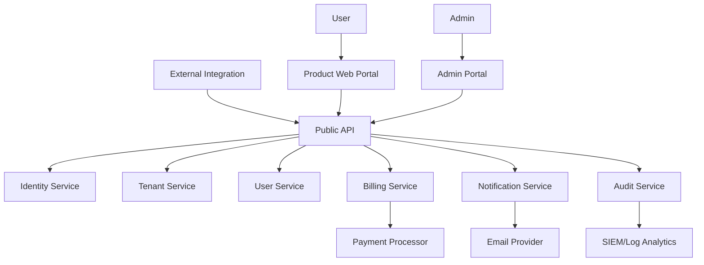
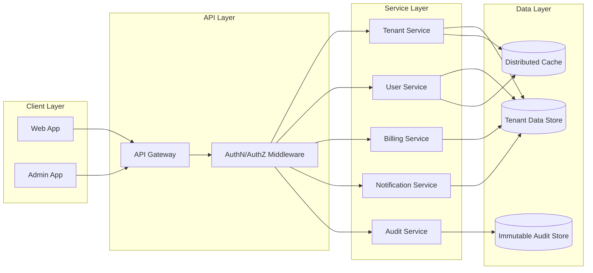

# High Level Design (HLD)

## Context Diagram



## Container Diagram



## Deployment Topology

```mermaid
flowchart TB
  subgraph Harvester HCI
    VMCluster[Virtualized Infrastructure Nodes]
  end

  subgraph Rancher Managed Kubernetes
    Ingress[Ingress Controller]
    NamespaceDev[dev Namespace]
    NamespaceStaging[staging Namespace]
    NamespaceProd[prod Namespace]
  end

  subgraph GitOps and App Platform
    Fleet[Fleet GitOps Controller]
    Coolify[Coolify App Platform]
    GitHub[GitHub Repository]
  end

  GitHub --> Fleet
  GitHub --> Coolify
  Fleet --> NamespaceDev
  Fleet --> NamespaceStaging
  Fleet --> NamespaceProd
  Coolify --> Ingress
  Rancher Managed Kubernetes --> Harvester HCI
```

## Service Boundaries

| Service | Responsibilities | Exposed APIs |
|---|---|---|
| Tenant Service | Tenant and Org lifecycle, onboarding state | `/tenants`, `/orgs` |
| User Service | User lifecycle, RBAC policy assignment | `/users`, `/roles` |
| Billing Service | Subscription, usage metering, invoices | `/billing/*` |
| Notification Service | Template resolution and message delivery | `/notifications/*` |
| Audit Service | Immutable audit events and search | `/audit-logs` |

## Environment Strategy

- **dev**: rapid feedback, relaxed quotas, synthetic data
- **staging**: production-like validation and release verification
- **prod**: strict controls, SLO enforcement, audited releases

## Non-Functional Targets

- p95 API latency under 200 ms for read operations
- 99.9% availability in production
- zero critical-severity policy bypasses during release

