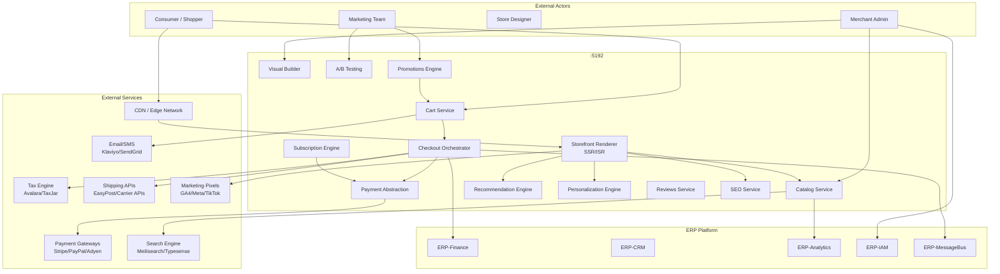
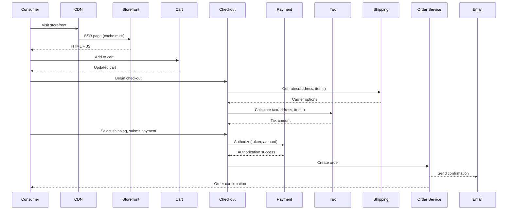
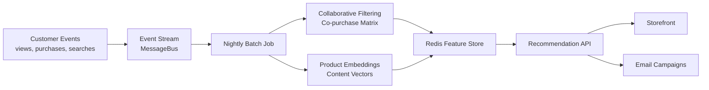

# High-Level Design (HLD)
## ERP-eCommerce — B2C/D2C eCommerce Platform Architecture
### Version 2.0 | March 2026

---

## 1. Context Diagram



---

## 2. Architecture Principles

| Principle | Rationale |
|-----------|-----------|
| Headless-first | All commerce logic exposed via API; visual builder is a client, not the only interface. Enables any frontend (Next.js, mobile, social) to consume commerce services. |
| Edge-optimized rendering | Storefront pages rendered at CDN edge via SSR/ISR for sub-second TTFB globally. Personalized content hydrated client-side after initial static render. |
| Checkout as orchestration | Checkout is a multi-step saga coordinating address validation, shipping rates, tax calculation, payment authorization, inventory decrement, and order creation — not a monolithic process. |
| Payment gateway abstraction | Merchants bring their own payment accounts; platform abstracts gateway differences behind a unified interface. No raw card data touches our infrastructure (PCI SAQ-A). |
| Recommendation as a service | ML recommendation engine runs independently with its own feature store, serving recommendations via low-latency API. Cold-start handled by content-based fallback. |
| Event-driven customer data | Every customer interaction (view, search, add-to-cart, purchase, review) emits events to build the behavioral profile used by personalization and recommendations. |

---

## 3. Service Architecture

### 3.1 Storefront Renderer

**Responsibility**: Server-side rendering of storefront pages, incremental static regeneration, edge caching, theme/template management, dynamic section hydration.

**Key Design Decisions**:
- Pages composed from reusable sections (components) stored as JSON configuration
- SSR pipeline: load page config → resolve product/collection data → render HTML → cache at edge
- ISR with stale-while-revalidate: serve cached page, regenerate in background when content changes
- Personalized sections (recommendations, recently viewed, segment banners) excluded from SSR cache; loaded via client-side JS after initial render
- Core Web Vitals optimized: critical CSS inlined, images lazy-loaded with srcset, fonts preloaded, JS deferred

**Rendering Pipeline**:
```
Request → CDN Edge Cache Check
  → [HIT] Serve cached HTML + hydrate dynamic sections
  → [MISS] SSR: Page Config → Data Fetching → Template Render → HTML Response → Cache at Edge
```

### 3.2 Visual Storefront Builder

**Responsibility**: Drag-and-drop page builder UI, component library management, theme settings, live preview, version control.

**Key Design Decisions**:
- Page builder stores configuration as JSON (not HTML) for portability and rendering flexibility
- Component library with merchant-installable extensions
- Real-time preview via iframe with hot-reload on configuration changes
- Version history with git-like diff and one-click rollback
- Responsive editing: configure different layouts per breakpoint

### 3.3 Catalog Service

**Responsibility**: Product CRUD, variant management, collection management, inventory tracking, digital asset management.

**Key Design Decisions**:
- Products stored in PostgreSQL with JSONB for flexible option/metafield storage
- Full-text search delegated to Meilisearch/Typesense with incremental sync via change data capture
- Collections: manual (ordered product list) and smart (rule-based, auto-updated on product changes)
- Inventory tracked per variant per location with real-time decrement on order creation
- Image processing pipeline: upload → resize (multiple dimensions) → convert (WebP/AVIF) → CDN distribute

### 3.4 Cart Service

**Responsibility**: Cart CRUD, cart pricing (subtotal, discounts, tax estimate, shipping estimate), cart persistence, cart merge, cart expiry management.

**Key Design Decisions**:
- Cart stored in Redis for low-latency operations with PostgreSQL backup for durability
- Cart ID stored in HTTP cookie for anonymous users, linked to customer ID on authentication
- Cart pricing recalculated on every modification (add, remove, quantity change, discount code)
- Discount validation: check code validity, usage limits, minimum order requirements, product exclusions
- Cart events emitted for abandoned cart recovery triggers

**Cart Data Flow**:
```
Add Item → Validate Product/Variant Exists → Check Inventory → Calculate Line Price
  → Apply Discounts → Estimate Tax → Estimate Shipping → Return Updated Cart
```

### 3.5 Checkout Orchestrator

**Responsibility**: Multi-step checkout flow management, address validation, shipping rate calculation, tax calculation, payment processing coordination, order creation, inventory reservation.

**Key Design Decisions**:
- Saga pattern: each checkout step is independently recoverable
- Address validation via Google Places API with address standardization
- Shipping rates fetched in real-time from configured carriers (cached for 15 minutes per address+items)
- Tax calculated via Avalara/TaxJar based on final ship-to address, product tax codes, and exemptions
- Payment processed via gateway SDK (Stripe Elements, PayPal JS); only tokenized payment data sent to our API
- Inventory decrement happens atomically with order creation (optimistic lock with retry)
- Order creation emits events to: confirmation email, analytics, finance, fulfillment

**Checkout State Machine**:
```
CART → CONTACT_INFO → SHIPPING_ADDRESS → SHIPPING_METHOD
  → TAX_CALCULATED → PAYMENT_PENDING → PAYMENT_AUTHORIZED
  → ORDER_CREATED → CONFIRMATION
```

### 3.6 Payment Abstraction Layer

**Responsibility**: Unified payment interface across multiple gateways, payment method management, refund processing, subscription billing, dunning management.

**Key Design Decisions**:
- Gateway adapter pattern: `PaymentGateway` interface with `Stripe`, `PayPal`, `Adyen` implementations
- Payment flow: create intent → client-side tokenization → authorize → capture (on fulfillment)
- Refund flow: full or partial refund via original gateway → update order → notify customer
- Subscription billing: scheduled job creates payment intent → charge → retry on failure → dunning
- PCI compliance: no raw card numbers stored; all tokenization happens in gateway's client SDK

```go
type PaymentGateway interface {
    CreatePaymentIntent(amount Money, currency string, metadata map[string]string) (*PaymentIntent, error)
    AuthorizePayment(intentID string, token string) (*Authorization, error)
    CapturePayment(authorizationID string, amount Money) (*Capture, error)
    RefundPayment(captureID string, amount Money, reason string) (*Refund, error)
    CreateSubscription(customerID string, plan SubscriptionPlan) (*Subscription, error)
    CancelSubscription(subscriptionID string, immediate bool) error
}
```

### 3.7 Subscription Engine

**Responsibility**: Subscription lifecycle management, billing schedule execution, subscriber self-service, churn prevention, subscription analytics.

**Key Design Decisions**:
- Subscription stored as state machine: ACTIVE, PAUSED, PAST_DUE, CANCELLED, EXPIRED
- Billing scheduler: daily cron identifies subscriptions due for renewal, creates orders and payment intents
- Dunning sequence: retry day 1, 3, 7, 14 with escalating email urgency; cancel after 4 failures
- Self-service actions (skip, swap, pause) modify upcoming order without touching billing
- Retention flow on cancellation: offer pause → offer discount → offer product swap → accept cancellation with exit survey

### 3.8 Recommendation Engine

**Responsibility**: Product recommendation generation using collaborative filtering, content-based similarity, and personalized ranking.

**Key Design Decisions**:
- **Collaborative filtering**: Item-to-item similarity matrix computed from co-purchase data (batch, nightly)
- **Content-based**: Product embedding vectors from titles, descriptions, categories, tags (computed on product create/update)
- **Personalized**: User preference vector from browse/purchase history, dot-product with product embeddings
- **Cold-start**: New products use content-based only; new users see trending/popular items
- **Feature store**: Redis-cached precomputed recommendation lists per product and per user segment
- **Real-time signals**: Recently viewed products tracked in session for immediate cross-sell
- **API**: `GET /recommendations/{type}?product_id=X&customer_id=Y&limit=10` returns ranked product list

### 3.9 Personalization Engine

**Responsibility**: Customer segmentation, content variant selection, behavioral event processing, segment-based content targeting.

**Key Design Decisions**:
- Segments defined as rule sets evaluated against customer profiles (real-time on request)
- Behavioral events (page view, search, cart, purchase) aggregated into customer feature vectors
- Content variants assigned per segment: homepage hero, featured collections, email content
- Personalization applied as a layer on top of storefront rendering (dynamic sections)
- Privacy-compliant: segmentation based on first-party data only, GDPR consent respected

### 3.10 Search Service

**Responsibility**: Product search indexing, query processing, faceted filtering, autocomplete, search analytics.

**Key Design Decisions**:
- Meilisearch (or Typesense) as dedicated search engine, synced from PostgreSQL via CDC
- Index schema: title (weight 5x), description (2x), tags (3x), vendor (1x), SKU (4x)
- Facets: price range, category, color, size, brand, rating, availability
- Typo tolerance: up to 2 typos for words 5+ characters
- Synonyms: merchant-configurable synonym groups
- Search analytics: track queries, results, clicks, and conversions for relevance tuning

---

## 4. Data Flow Architecture

### 4.1 Purchase Flow



### 4.2 Recommendation Data Pipeline



---

## 5. Integration Architecture

### 5.1 Internal ERP Integration

| Target Module | Integration Method | Data Flow |
|---------------|--------------------|-----------|
| ERP-Finance | Sync API + Events | Revenue records, refunds, tax remittance, merchant payouts |
| ERP-CRM | Events via MessageBus | Customer profiles, support context, communication history |
| ERP-Analytics | Events via MessageBus | Order events, funnel events, conversion tracking, cohort data |
| ERP-IAM | API (AuthN/AuthZ) | Merchant authentication, customer authentication, API keys |
| ERP-MessageBus | NATS/Kafka | All domain events: orders, carts, customers, products, subscriptions |

### 5.2 External Integration

| System | Protocol | Purpose |
|--------|----------|---------|
| Stripe/PayPal/Adyen | REST + Webhooks | Payment processing, subscription billing |
| Meilisearch/Typesense | REST | Product search indexing and querying |
| Avalara/TaxJar | REST | Real-time tax calculation |
| EasyPost/Carrier APIs | REST | Shipping rate calculation, label generation |
| Klaviyo/Mailchimp | REST + Webhooks | Email/SMS marketing automation |
| Google Analytics 4 | Client-side JS + CAPI | Conversion tracking, audience building |
| Meta CAPI | Server-side REST | Conversion attribution for Facebook/Instagram ads |
| Cloudflare/Fastly | CDN API | Edge caching, image optimization, DDoS protection |

---

## 6. Deployment Architecture

```
┌─────────────────────────────────────────────┐
│          CDN Edge Network (200+ PoPs)        │
│     Cached SSR pages, images, static assets  │
└─────────────────┬───────────────────────────┘
                  │
┌─────────────────▼───────────────────────────┐
│       eCommerce API Gateway (:5192)          │
│   Rate Limiting │ Auth │ Routing │ CORS      │
└──┬───┬───┬───┬───┬───┬───┬───┬───┬────────┘
   │   │   │   │   │   │   │   │   │
┌──▼┐┌─▼─┐┌▼──┐┌▼──┐┌▼──┐┌▼──┐┌▼──┐┌▼──┐┌▼──┐
│ SF ││CAT││CRT││CHK││PAY││SUB││REC││PER││SRC│
└──┬┘└──┬┘└──┬┘└──┬┘└──┬┘└──┬┘└──┬┘└──┬┘└──┬┘
   │    │    │    │    │    │    │    │    │
┌──▼────▼────▼────▼────▼────▼────▼────▼────▼──┐
│           PostgreSQL (Primary + Replicas)     │
│        ecommerce_db (per-service schemas)    │
└──────────────────┬──────────────────────────┘
                   │
┌──────────────────▼──────────────────────────┐
│              Redis Cluster                   │
│  Cart data │ Sessions │ Rec cache │ Rates    │
└──────────────────┬──────────────────────────┘
                   │
┌──────────────────▼──────────────────────────┐
│          Meilisearch / Typesense             │
│         Product search index                 │
└─────────────────────────────────────────────┘
```

### 6.1 Infrastructure Requirements

| Component | Specification | Scaling Strategy |
|-----------|--------------|------------------|
| CDN | Cloudflare/Fastly | Global PoPs, auto-scales |
| API Gateway | 3 instances, 2 vCPU, 4GB RAM | Horizontal (auto-scale on RPS) |
| Storefront Renderer | 4 instances, 4 vCPU, 8GB RAM | Horizontal (scale on traffic) |
| Catalog Service | 2 instances, 2 vCPU, 4GB RAM | Horizontal (read replicas) |
| Cart Service | 3 instances, 2 vCPU, 4GB RAM | Horizontal (stateless, scale on cart ops) |
| Checkout | 3 instances, 2 vCPU, 4GB RAM | Horizontal (scale on checkouts) |
| Recommendation Engine | 2 instances, 4 vCPU, 16GB RAM | Vertical (ML model memory) |
| Search Engine | 2 instances, 4 vCPU, 8GB RAM | Horizontal (search replicas) |
| PostgreSQL | Primary + 3 read replicas, 8 vCPU, 32GB RAM | Vertical + replicas |
| Redis | 3-node cluster, 8GB RAM per node | Cluster scaling |

---

## 7. Security Architecture

### 7.1 PCI Compliance
- PCI DSS Level 1 scope minimized through tokenization-only architecture
- No raw card data transits or rests on our infrastructure
- Payment SDKs (Stripe Elements, PayPal JS) handle card collection client-side
- Quarterly external vulnerability scans (PCI ASV)
- Annual penetration test and PCI-DSS audit

### 7.2 Customer Data Protection
- TLS 1.3 for all API and storefront communication
- AES-256 encryption at rest for PostgreSQL and Redis
- PII (email, phone, address) encrypted at application layer with per-tenant keys
- Customer password hashing with Argon2id
- GDPR compliance: data export, data deletion, consent management
- CCPA compliance: opt-out of data sale, data access requests

### 7.3 Storefront Security
- Content Security Policy (CSP) headers preventing XSS
- CORS configuration per merchant domain
- Bot detection and rate limiting for checkout and cart APIs
- DDoS protection via CDN (Cloudflare/Fastly)
- Flash sale protection: queue-based checkout to prevent overselling

---

## 8. Monitoring and Observability

| Metric Category | Key Metrics | Alert Thresholds |
|-----------------|-------------|------------------|
| Storefront | LCP, FID, CLS (Core Web Vitals), TTFB, cache hit rate | LCP > 2.5s, cache hit < 90% |
| Conversion Funnel | Visit → PDP → ATC → Checkout → Purchase (rates at each step) | >10% drop in any step vs. 7-day avg |
| Cart | Cart creation rate, abandonment rate, recovery rate | Abandonment > 75% |
| Checkout | Checkout start rate, payment success rate, average checkout time | Payment fail > 5%, time > 120s |
| Search | Query volume, zero-result rate, CTR, latency | Zero-result > 10%, latency > 300ms |
| Recommendations | Click-through rate, revenue attribution, coverage | CTR < 2%, coverage < 60% |
| Subscriptions | MRR, churn rate, failed payments, dunning recovery | Churn > 10%/month, fail > 5% |
| Infrastructure | API latency p50/p95/p99, error rate, CPU/memory | p99 > 2s, error > 1% |

---

*Document Classification: Internal — Confidential*
*Last Updated: March 2026*
*Owner: Engineering — eCommerce Platform*
