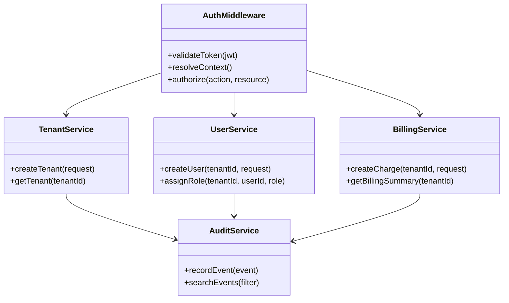
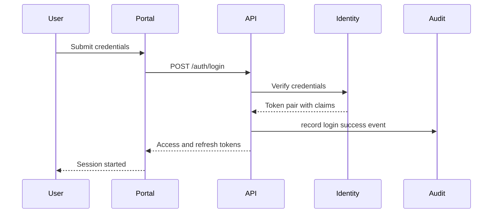
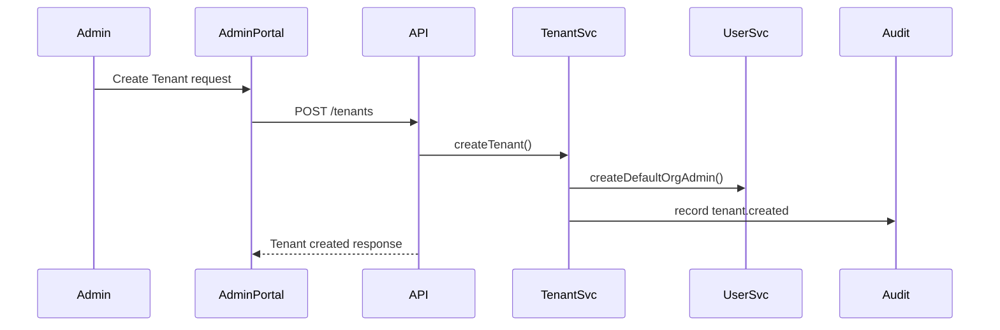
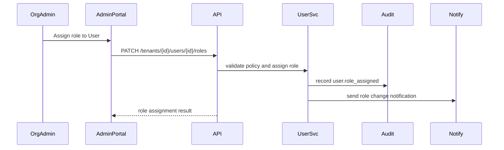
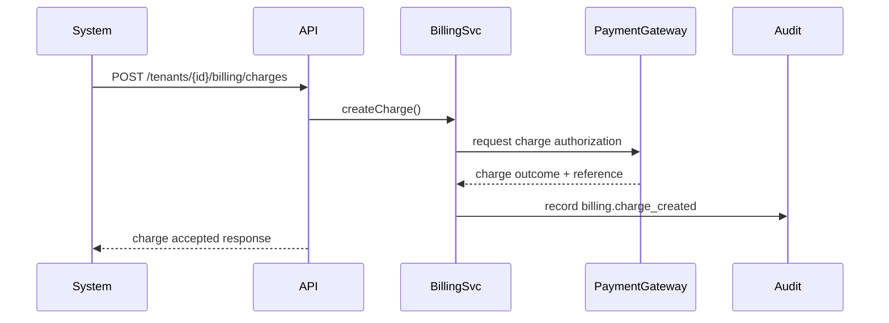
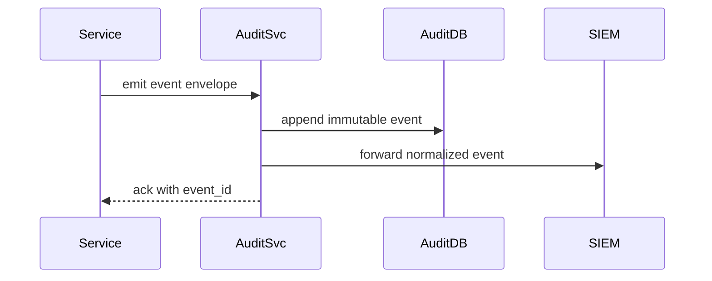

# Low Level Design (LLD)

## Module Design

### Identity and Access Module

- Validates JWT signature, issuer, audience, and expiration.
- Resolves role claims for Tenant and Org scope.
- Enforces route-level policy checks.

### Tenant Management Module

- Creates Tenant, default Org, baseline policies.
- Maintains tenant status lifecycle (active, suspended, archived).

### Billing Module

- Maintains subscription and usage records.
- Creates idempotent charge commands with external payment reference.

### Audit Module

- Writes immutable events with actor/action/target metadata.
- Supports indexed querying by Tenant, Org, actor, and action.

## Module Interaction (Pseudo UML)

## Sequence Diagrams

### Login

### Create Tenant

### Role Assignment

### Billing Charge

### Audit Log Write

## Data Access Patterns

- Every query includes Tenant key filter.
- Write operations include actor identity from token claims.
- Sensitive fields are encrypted before persistence.

## Caching Strategy

- Role and policy cache with short TTL (5 min) and explicit invalidation.
- Tenant configuration cache with event-based invalidation.

## Failure Handling

- Retries with exponential backoff for transient Service calls.
- Dead-letter queue for failed notification or audit forwarding operations.
- Idempotency keys for external billing requests.

## LLD-to-Test Mapping

- Policy engine tests for role assignment edge cases
- Transactional tests for tenant creation workflow
- Contract tests for billing and notification integrations

