# CI/CD Architecture and Delivery Model

## Overview

This pipeline design uses **Harvester HCI**, **Rancher**, **Fleet**, and **Coolify** together:

- **Harvester HCI** provides virtualized infrastructure foundation.
- **Rancher** manages Kubernetes clusters across Environments.
- **Fleet** enforces GitOps reconciliation of deployment manifests.
- **Coolify** handles app platform concerns (builds, app runtime automation, environment variables, and service wiring where applicable).

## How Components Work Together

1. Code and docs changes are pushed to GitHub.
2. CI workflow runs lint, tests, security checks, and build validations.
3. Artifact and manifest updates are committed to environment branches.
4. Fleet watches Git and reconciles manifests into Rancher-managed clusters.
5. Rancher applies workload policies and deployment strategies on clusters running on Harvester HCI.
6. Coolify manages app-level deployment orchestration and runtime config where selected teams need simplified app operations.

## Pipeline Stages

1. **Pre-merge Validation**
   - markdown lint and link checks
   - OpenAPI lint
   - security scanning
2. **Build and Test**
   - unit/integration/e2e test sets
   - artifact creation
3. **Staging Promotion**
   - deploy via Fleet reconciliation
   - smoke tests and synthetic checks
4. **Production Promotion**
   - change approval gate
   - canary rollout
   - post-deploy verification

## Promotion Flow (dev -> staging -> prod)

```mermaid
flowchart LR
  Dev[Dev Merge] --> CI[CI Validation]
  CI --> ManifestUpdate[GitOps Manifest Update]
  ManifestUpdate --> FleetSync[Fleet Reconcile]
  FleetSync --> Staging[Staging Deploy]
  Staging --> Verify[Smoke + E2E + SLO Check]
  Verify --> ProdApprove[Production Approval]
  ProdApprove --> Canary[Canary Rollout]
  Canary --> FullProd[Full Production Rollout]
```



## Rollback Strategy

- Fleet rollback by reverting manifest commit.
- Coolify rollback to previous deployment image tag.
- Rancher workload rollback to prior ReplicaSet state.
- Incident runbook requires rollback decision in less than 15 minutes for sev-1 events.

## IaC and Manifest Structure Recommendation

```text
infrastructure/
  terraform/
    harvester/
    networking/
    observability/
  kubernetes/
    base/
    overlays/
      dev/
      staging/
      prod/
  fleet/
    bundles/
      platform/
      product/
```

## Policy Checks

- enforce image signature validation
- block privileged containers by default
- require resource requests/limits
- require readiness/liveness probes
- enforce namespace and network policies

## Secret Management

- No secrets in Git
- Environment-specific secret references only
- Rotation cadence documented in operations runbooks

## Release Evidence

- CI run id
- security scan report
- test summary
- deployment manifest hash
- approval artifact

