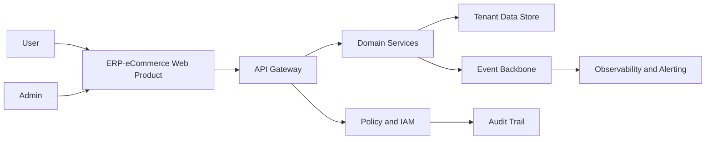

# ERP-eCommerce Technology and Scalability Architecture

## Architecture Overview

a) Product Layer: web app + admin console

b) API Layer: versioned API gateway and service mesh

c) Domain Services: workflow, policy, billing, notifications, audit

d) Data and Event Layer: tenant-aware persistence + event streaming

e) Reliability Layer: observability, SLOs, autoscaling, DR controls

## System Diagram

## Scalability Targets

| Dimension | Target |
|---|---|
| Availability | 99.95% |
| Critical workflow p95 latency | <250ms |
| DR objective | RPO <=15 min, RTO <=2 hr |
| Multi-tenant isolation | strict policy and data boundary enforcement |
