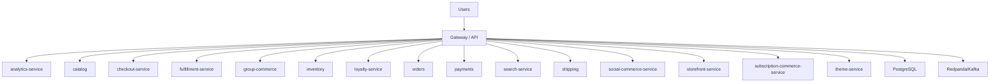

# ERP-eCommerce Architecture

## C4 Context
- Module: `ERP-eCommerce`
- Mode: standalone_plus_suite
- Auth: ERP-IAM (OIDC/JWT)
- Entitlements: ERP-Platform

## Container View

## Service Inventory
- `analytics-service`
- `catalog`
- `checkout-service`
- `fulfillment-service`
- `group-commerce`
- `inventory`
- `loyalty-service`
- `orders`
- `payments`
- `search-service`
- `shipping`
- `social-commerce-service`
- `storefront-service`
- `subscription-commerce-service`
- `theme-service`
